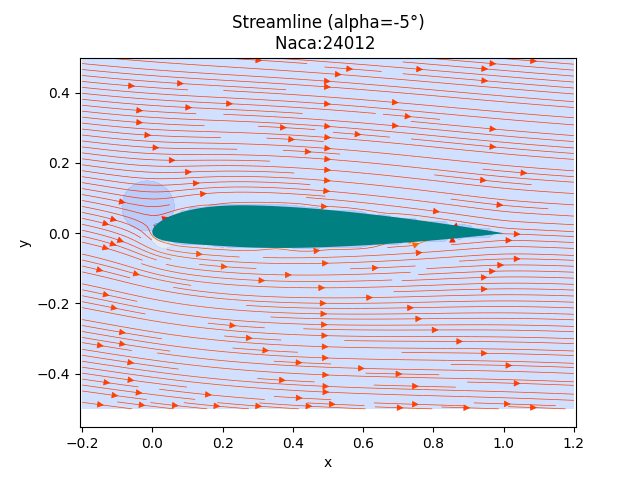
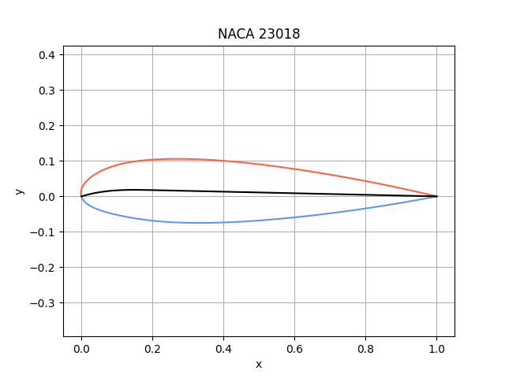
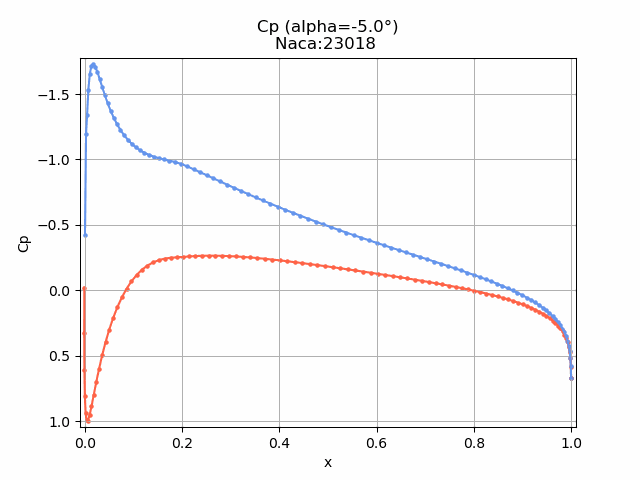

## **本项目仅供学习参考使用，请勿直接抄袭作为自己的作业**，请尊重他人的劳动成果，否则后果自负~

## 简介

* 本项目包含NACA4、NACA5、NACA0翼型的通用计算，及二维翼型的无粘不可压条件下的面涡法气动求解
* 为ZJU飞蛇 空气动力学大作业的python实现
* 本项目仅作存档，不维护，但欢迎issue&pr

## 说明

* 提供了直接积分的方法与分段积分，详见`./calculator/calculate.py`111行左右）
* 目前支持全系列Naca翼型（四位数、五位数、对称翼型 即Naca4 Naca5 Naca0）
* 对于render_pots方法增加is_show选项，可以在生成gif时不显示实时窗口（建议打开，render速度会快不少）
* 如要直接使用，可以使用`./calculator/calculate_fin.py`

## 展示

## 已知问题

好像存在薄翼理论的某一个值的计算存在问题，请仔细检查